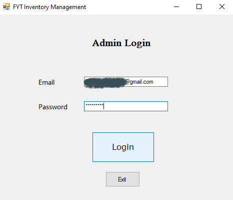
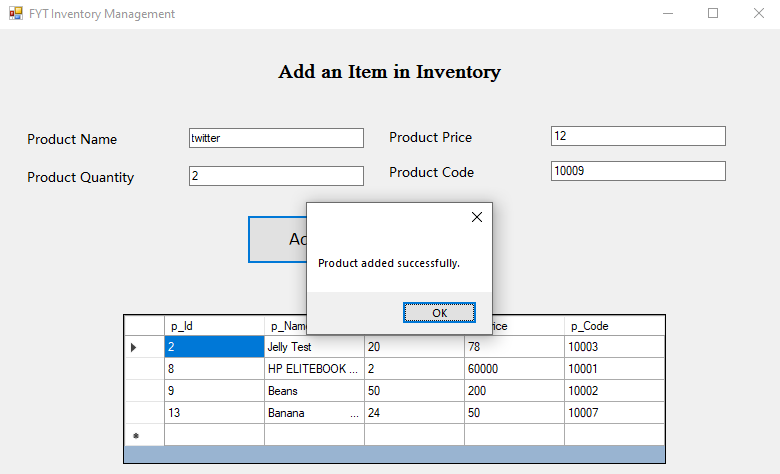

# FYT Inventory Management System
## Description
This is a simple inventory management system made in C# with database connectivity. It can perform 4 basic functions of add, delete, update and select of database.

Code explaination: https://www.youtube.com/watch?v=gGwyfnL-J_w

### Output

[FurqanHun Github](https://github.com/FurqanHun)